Language analysis
=================

Top languages
-------------

Top languages according to title count in each “national” context

Top languages by town
---------------------

Top languages by town (based on the indicated catalog).

Top-N languages by town by decade
---------------------------------

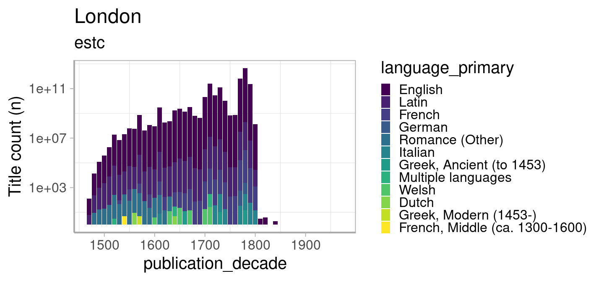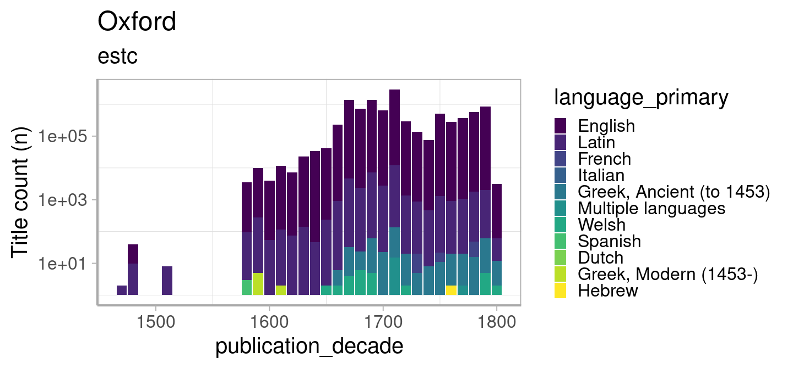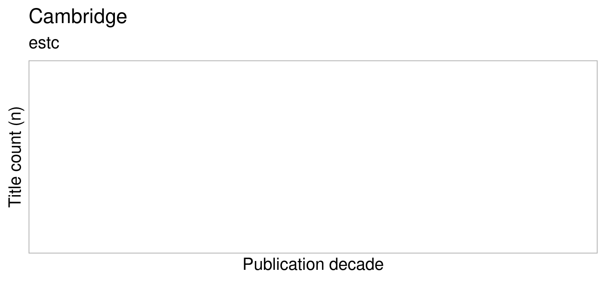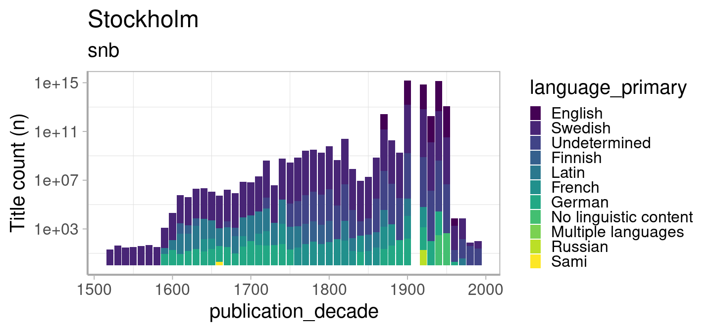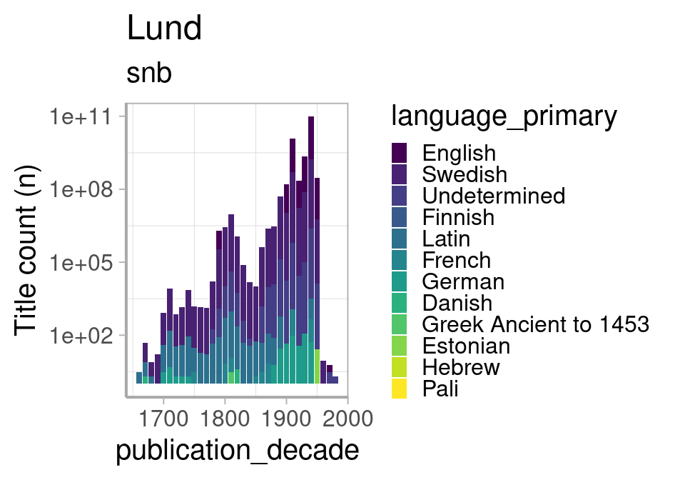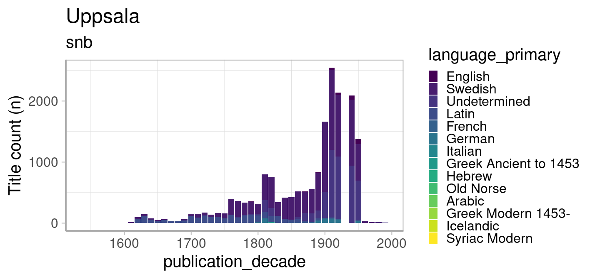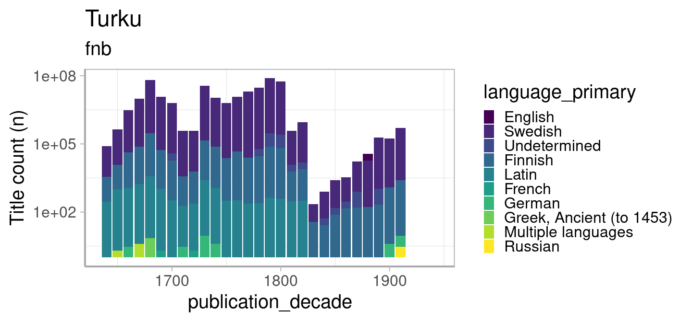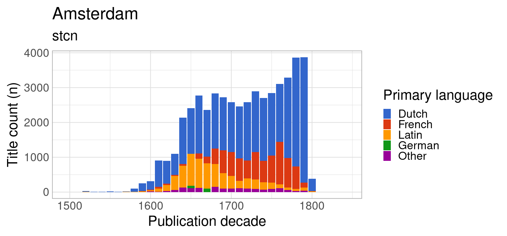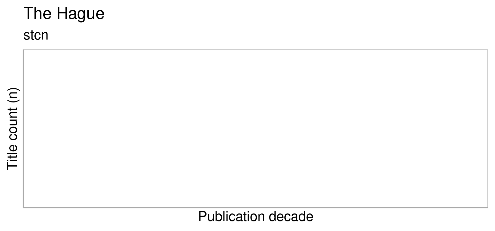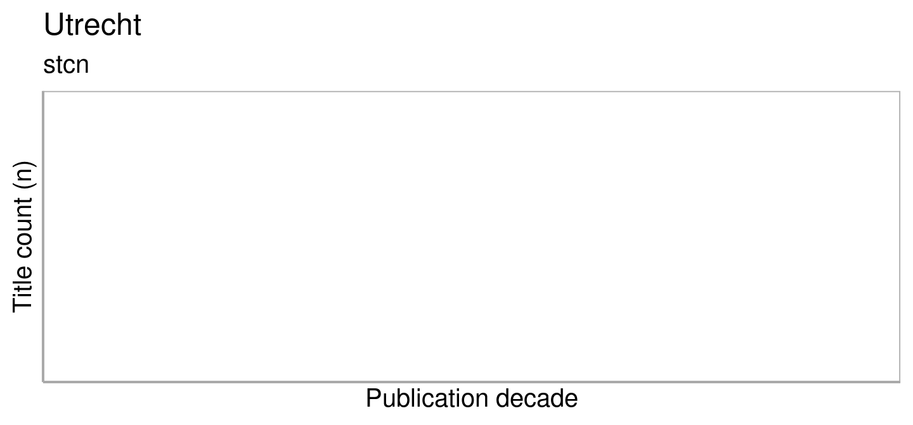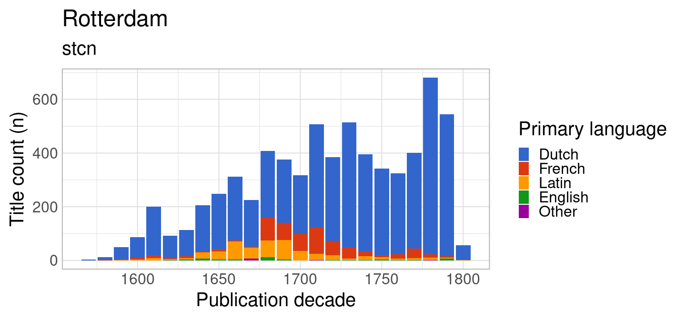
