Language analysis
=================

Top languages
-------------

Top languages according to title count in each “national” context

-   UK based on ESTC
-   Sweden based on SNB
-   The Netherlands based on HPB
-   Austria based on HPB
-   Estonia based on HPB
-   Finland based on FNB

Top languages by title count.

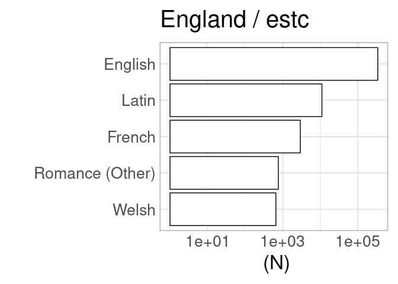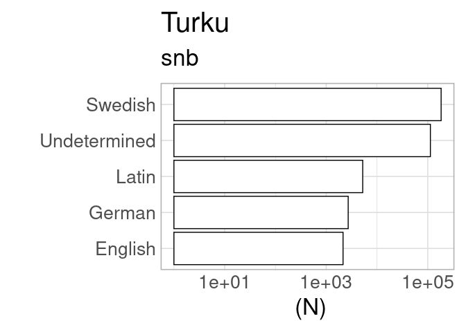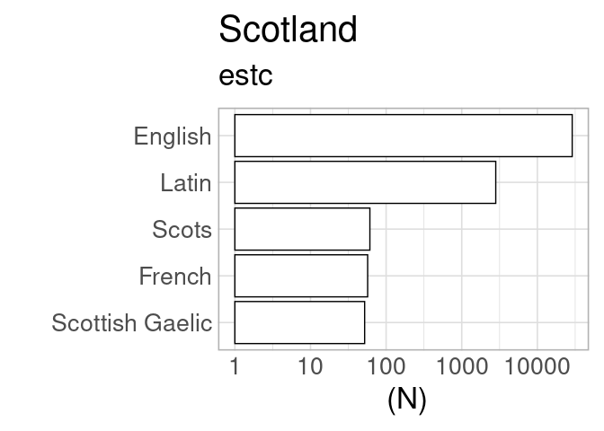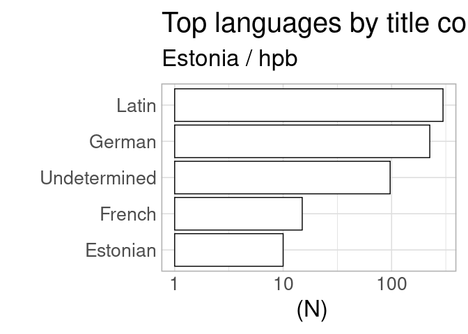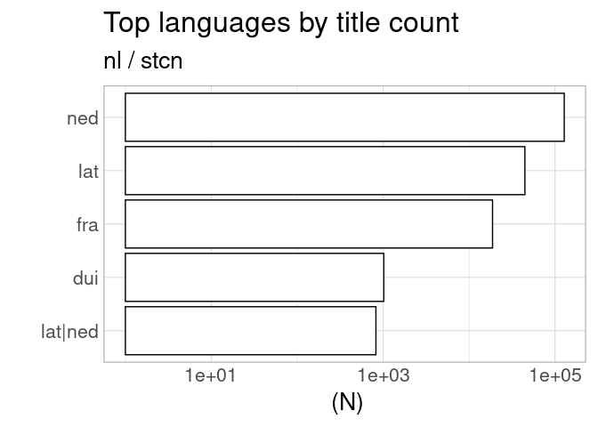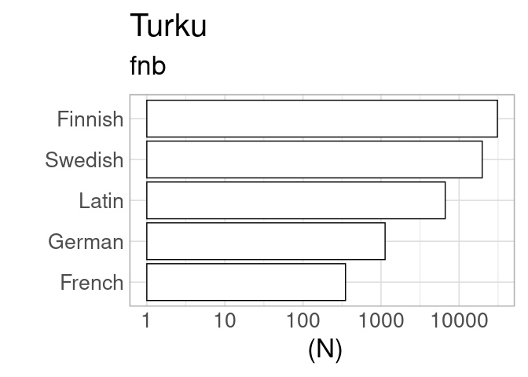

Top languages by town
---------------------

Top languages by town (based on the indicated catalog).

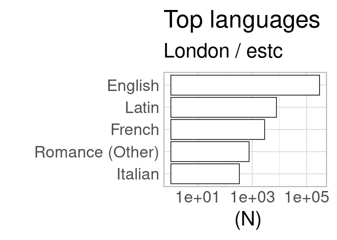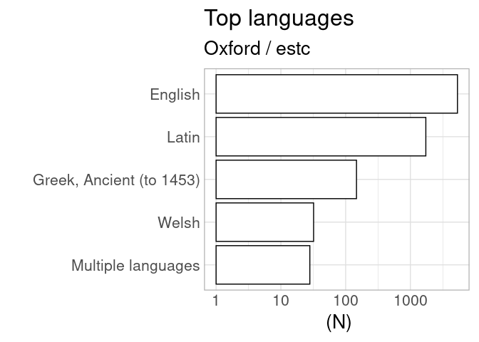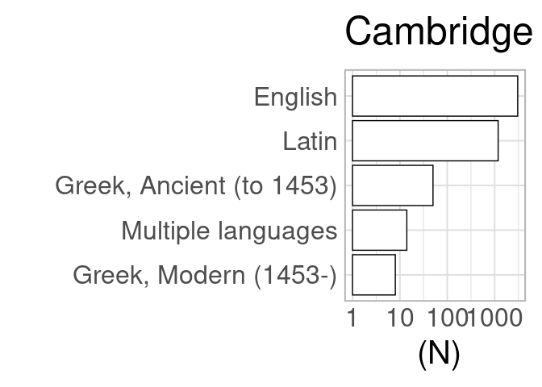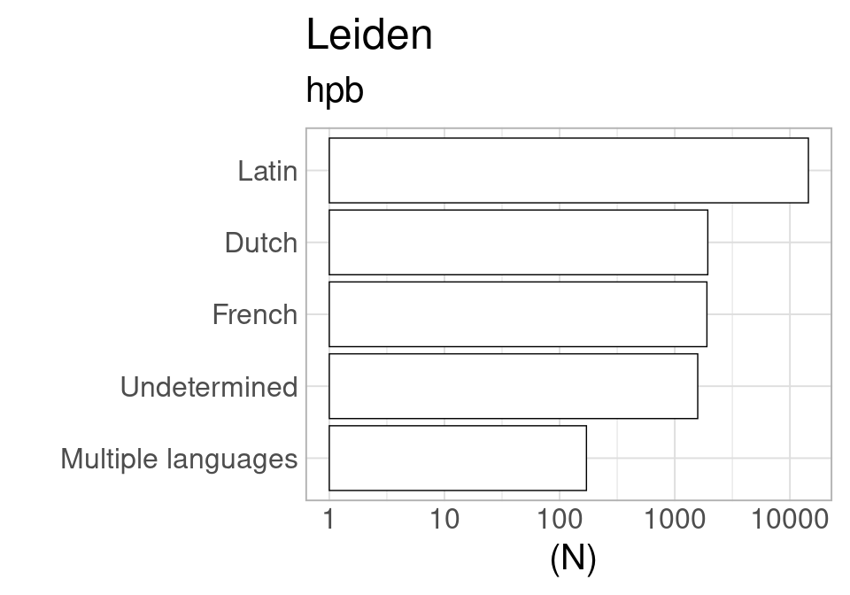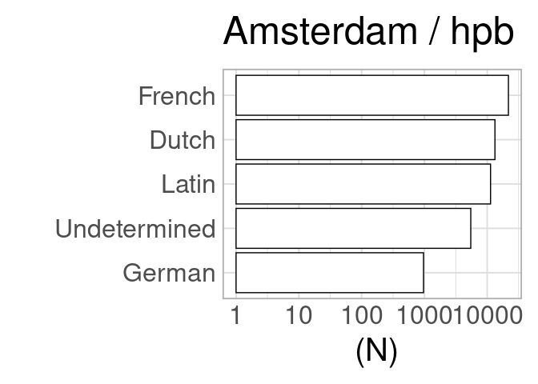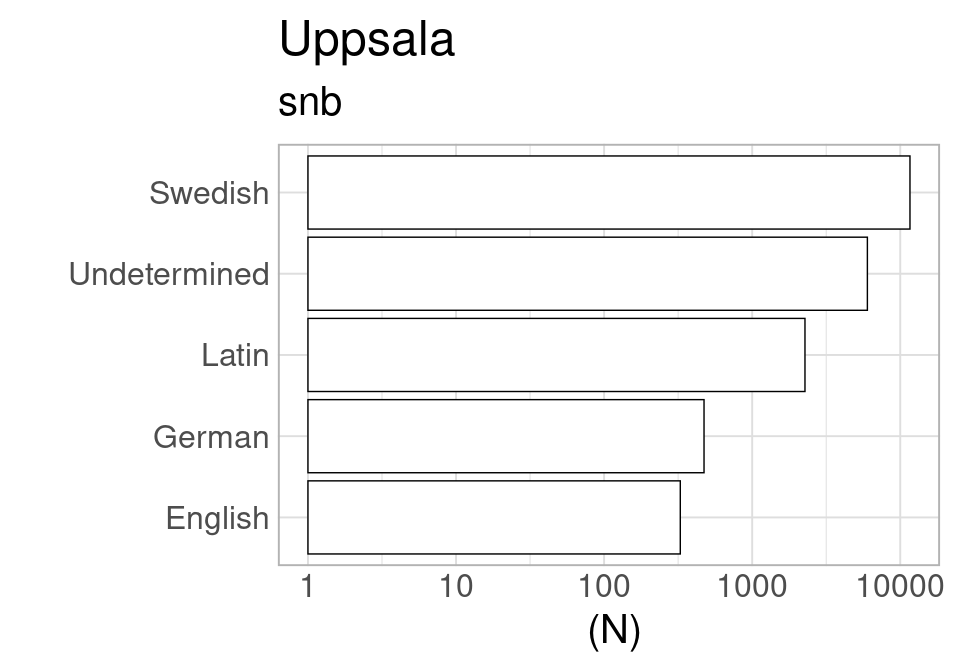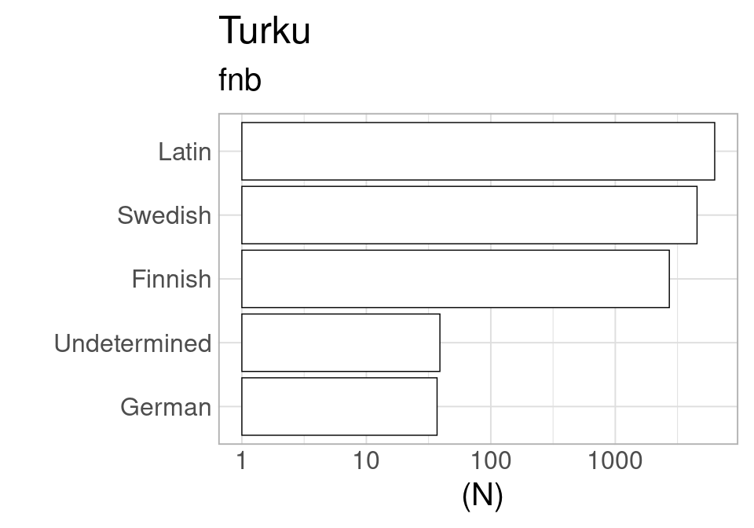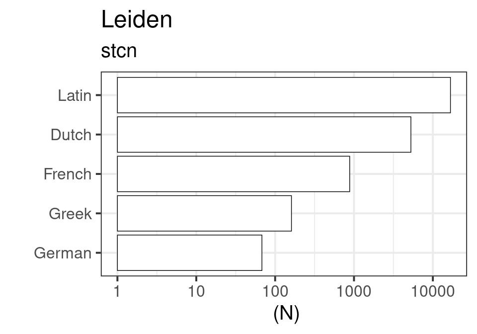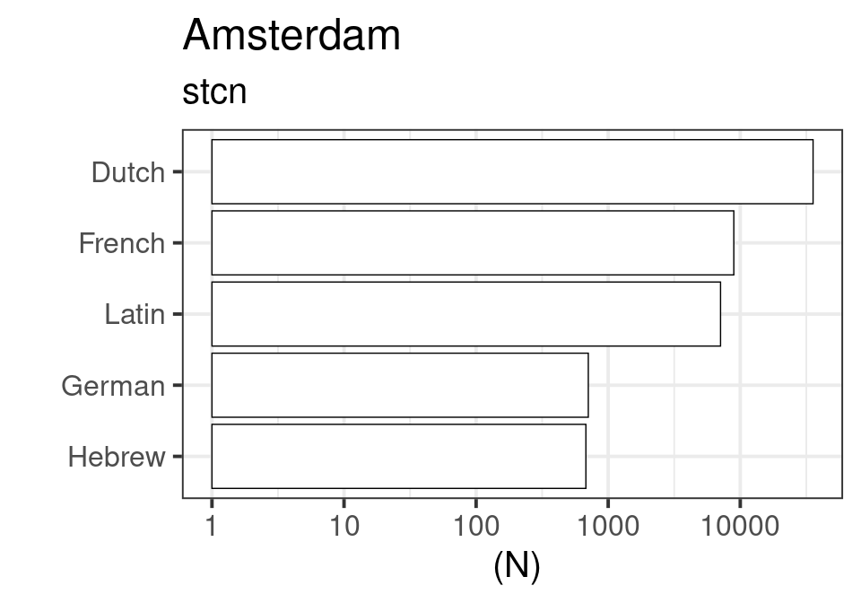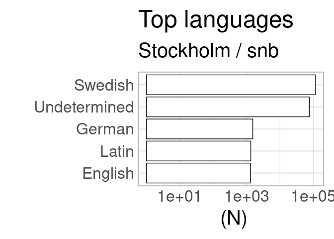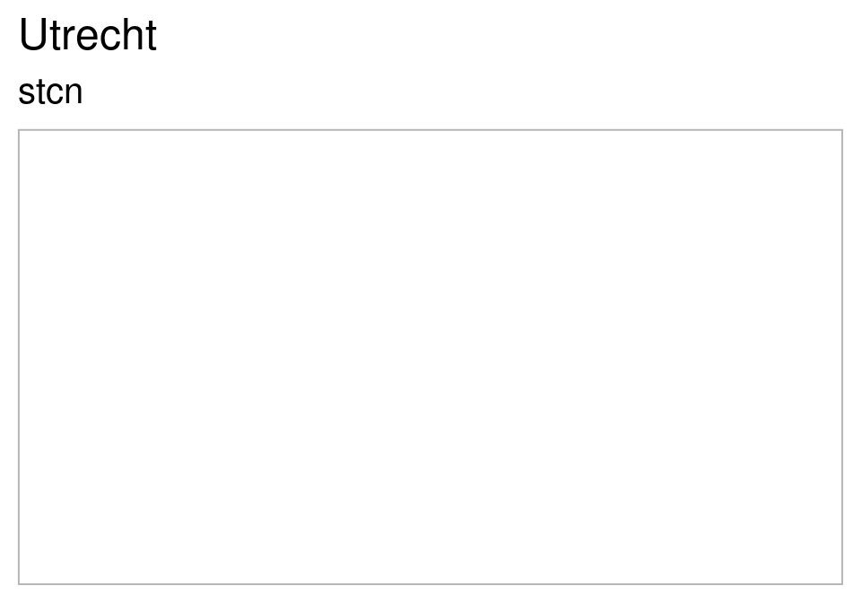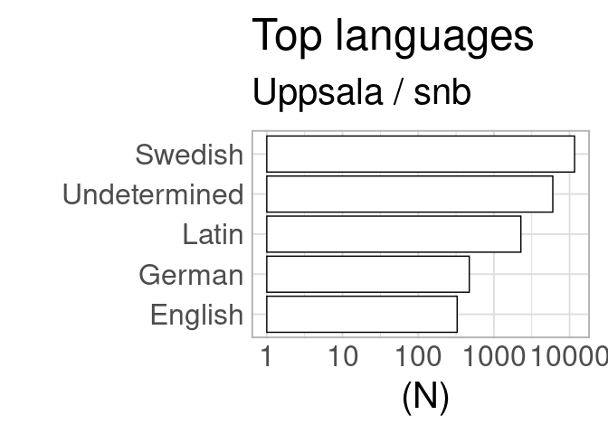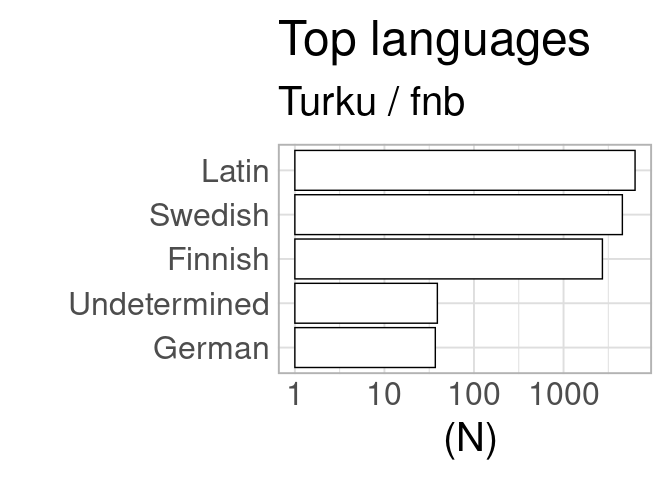
