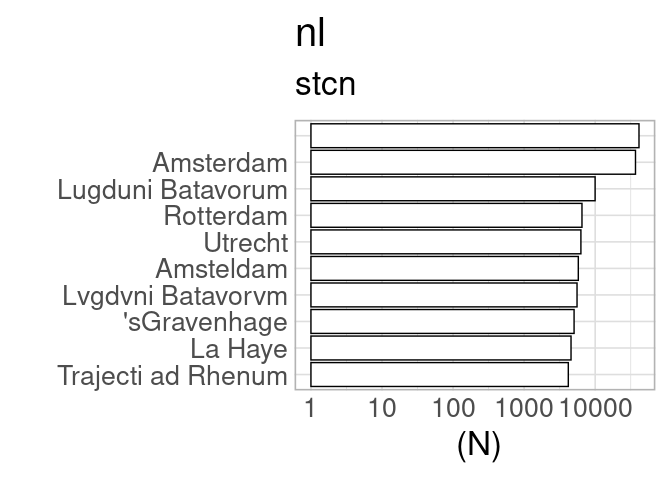

Publication place analysis
==========================

Top places
----------

Top towns according to title count in each “national” context.

Countries per catalog
---------------------

Summary of selected countries per catalog, for quality control purposes.
Should have the same countries than above.

    ## [1] "estc"
    ## 
    ##  England  Germany  Ireland Scotland 
    ##   329399        1    26131    31904 
    ## [1] "----------"
    ## [1] "snb"
    ## Sweden 
    ## 310100 
    ## [1] "----------"
    ## [1] "fnb"
    ## Finland 
    ##   59639 
    ## [1] "----------"
    ## [1] "stcn"
    ##     nl 
    ## 200441 
    ## [1] "----------"
