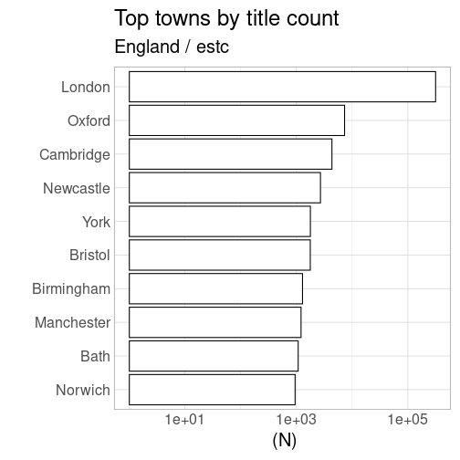
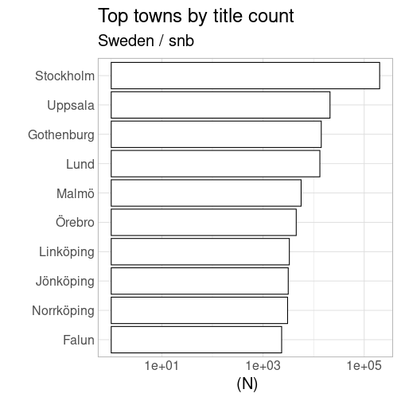
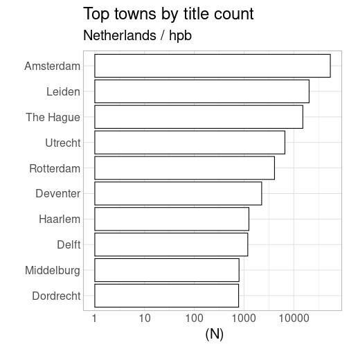
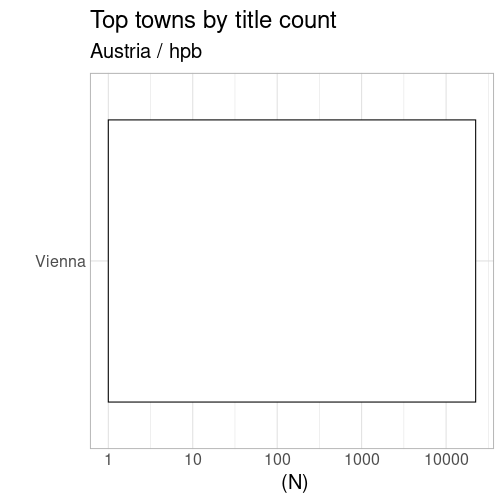
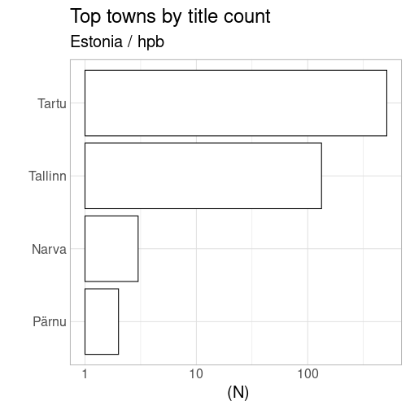
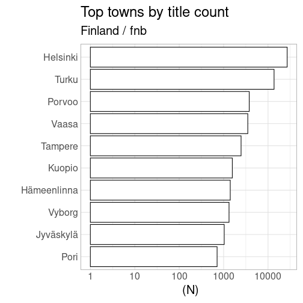

# Language analysis


## Top places

Top towns according to title count in each “national” context 
- Finland based on FNB

- UK based on ESTC
- Sweden based on SNB
- The Netherlands based on HPB 
- Austria based on HPB
- Estonia based on HPB


```
## [1] "estc"
## [1] "snb"
## [1] "hpb"
## [1] "fnb"
```




## Countries per catalog

Summary of selected countries per catalog, for quality control purposes. Should have the same countries than above.


```
## [1] "estc"
## England 
##  354803 
## [1] "----------"
## [1] "snb"
## Sweden 
## 310100 
## [1] "----------"
## [1] "hpb"
## 
##     Austria     Estonia Netherlands 
##       22397         651      109618 
## [1] "----------"
## [1] "stcn"
##     nl 
## 200023 
## [1] "----------"
## [1] "fnb"
## Finland 
##   59639 
## [1] "----------"
```
