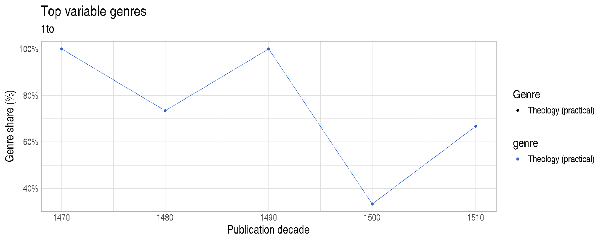
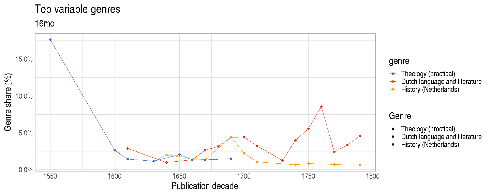
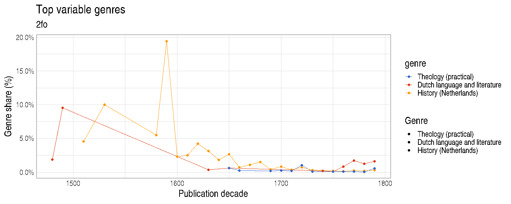
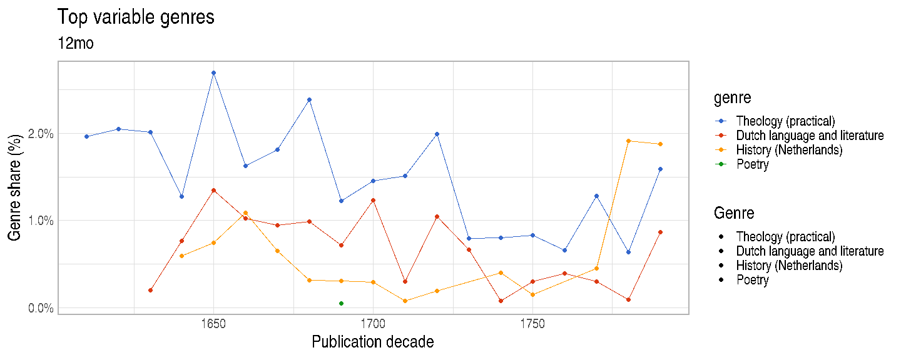
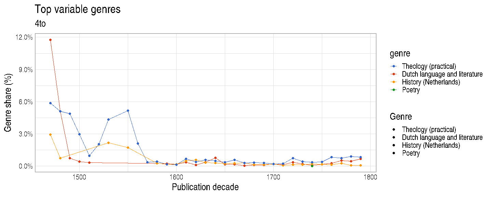
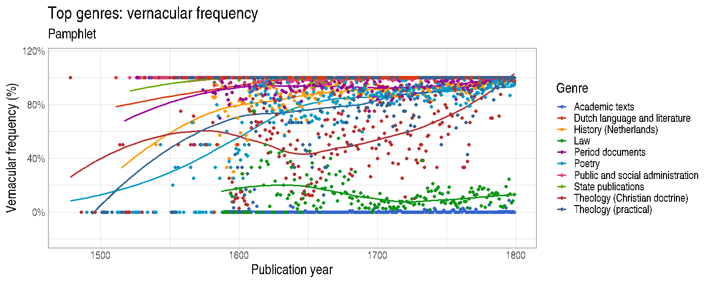
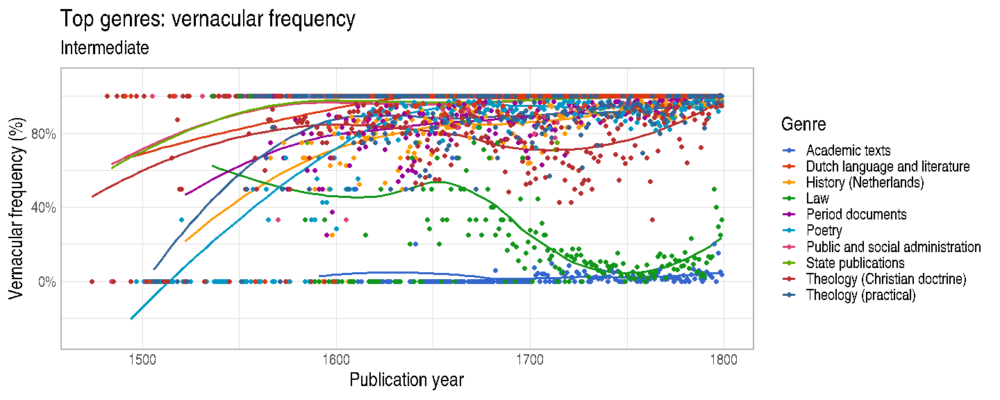
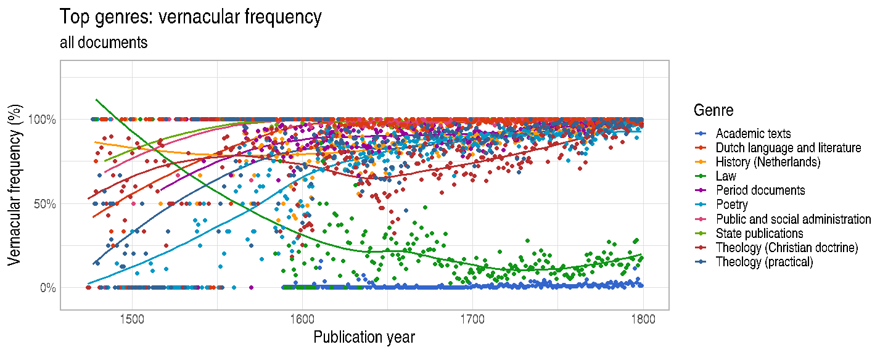

Genre analysis
==============

Top genres illustrated.

Here we show the ones with the highest standard deviation over time.

For a given genre, quantify variability from Latin to Vernacular
language.

For each document type, quantify top genres over time.

Same with all document types combined.

