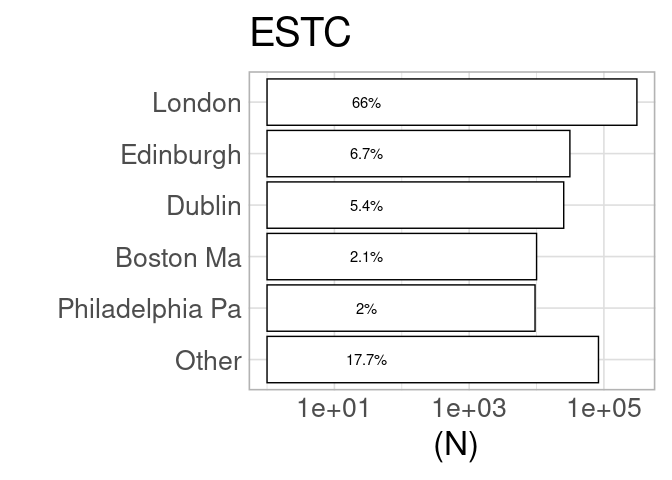
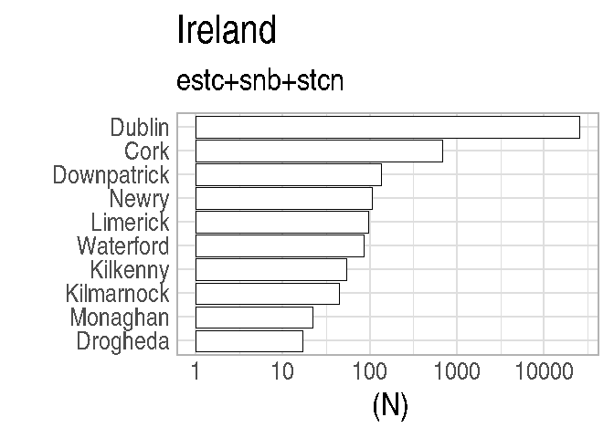
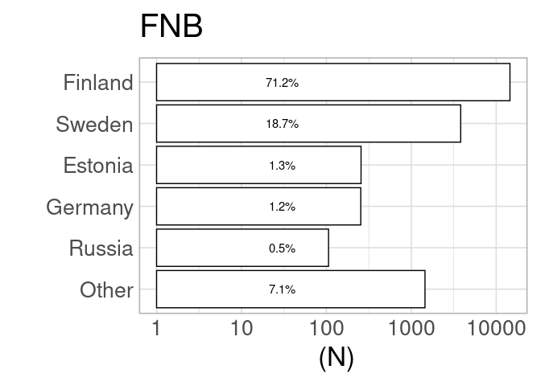
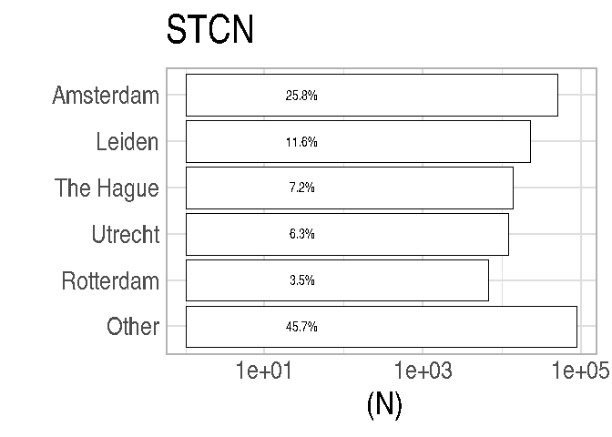
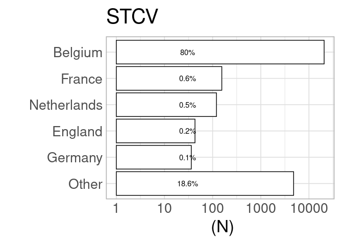

Publication place analysis
==========================

Top places
----------

Top towns according to title count in each “national” context.

    ## [1] "ESTC"
    ## 
    ## 
    ## |publication_country |      n|
    ## |:-------------------|------:|
    ## |England             | 346600|
    ## |Scotland            |  38980|
    ## |USA                 |  33615|
    ## |Ireland             |  26621|
    ## |France              |   3861|
    ## |Other               |  18463|

    ## [1] "SNB"
    ## 
    ## 
    ## |publication_country |     n|
    ## |:-------------------|-----:|
    ## |Sweden              | 66238|
    ## |Finland             |  1730|
    ## |Germany             |  1356|
    ## |England             |   481|
    ## |Denmark             |   423|
    ## |Other               |  3886|

    ## [1] "FNB"
    ## 
    ## 
    ## |publication_country |     n|
    ## |:-------------------|-----:|
    ## |Finland             | 14525|
    ## |Sweden              |  3818|
    ## |Estonia             |   256|
    ## |Germany             |   254|
    ## |Russia              |   106|
    ## |Other               |  1450|

    ## [1] "STCN"
    ## 
    ## 
    ## |publication_country |      n|
    ## |:-------------------|------:|
    ## |Netherlands         | 129027|
    ## |Belgium             |   5247|
    ## |Suriname            |   4836|
    ## |Germany             |   4099|
    ## |France              |   1843|
    ## |Other               |  48623|

    ## [1] "STCV"
    ## 
    ## 
    ## |publication_country |     n|
    ## |:-------------------|-----:|
    ## |Belgium             | 20669|
    ## |France              |   155|
    ## |Netherlands         |   120|
    ## |England             |    43|
    ## |Germany             |    36|
    ## |Other               |  4805|

Countries per catalog
---------------------

Summary of selected countries per catalog, for quality control purposes.
Should have the same countries than above.

    ## [1] "estc"
    ## 
    ##                                   Ambiguous               Antiqua 
    ##                   608                     2                    21 
    ##                 Aruba             Australia               Austria 
    ##                     2                     3                    31 
    ##               Bahamas              Barbados               Belgium 
    ##                    19                    58                   562 
    ##                Canada                  Cuba        Czech Republic 
    ##                   976                     3                     2 
    ##        Czezh Republic               Denmark              Dominica 
    ##                     1                    34                    45 
    ##               England                France                Geneva 
    ##                346600                  3861                     1 
    ##               Germany               Grenada            Guadaloupe 
    ##                   825                    17                     4 
    ##             Guernesey              Guernsey                 Haiti 
    ##                    12                    11                    51 
    ##               Hamburg               Hungary                 India 
    ##                     1                     2                   310 
    ##               Ireland           Isle of Man                 Italy 
    ##                 26621                    17                   243 
    ##               Jamaica                Latvia                 Malta 
    ##                   249                     3                    10 
    ##            Martinique                Mexico           Netherlands 
    ##                    11                     1                  2138 
    ##      Northern Ireland                Poland              Portugal 
    ##                   872                     6                    11 
    ##                Russia Saint Kitts and Nevis           Saint Lucia 
    ##                    25                    20                     1 
    ##              Scotland          South Africa                 Spain 
    ##                 38980                     1                    15 
    ##             Sri Lanka          St Eustatius            St Vincent 
    ##                     2                     1                    33 
    ##                Sweden           Switzerland   Trinidad and Tobago 
    ##                    32                   290                     4 
    ##                Turkey                   USA                 Wales 
    ##                     1                 33615                     1 
    ## [1] "----------"
    ## [1] "snb"
    ## 
    ##        Austria        Belgium         Canada     Copenhagen Czech Republic 
    ##             16             13              1             32              5 
    ##        Denmark        England        Estonia        Finland         France 
    ##            423            481            167           1730            241 
    ##        Germany        Ireland          Italy         Latvia      Lithuania 
    ##           1356              5            108             84             11 
    ##    Netherlands         Norway         Poland       Portugal         Russia 
    ##            211             25             82              8             61 
    ##       Scotland          Spain         Sweden    Switzerland        Ukraine 
    ##              8             15          66238             35              1 
    ##            USA 
    ##             22 
    ## [1] "----------"
    ## [1] "fnb"
    ## 
    ##     Austria     Belgium  Copenhagen     Denmark     England     Estonia 
    ##           2           2           3          18          50         256 
    ##     Finland      France     Germany       Italy      Latvia   Lithuania 
    ##       14525          31         254           4          39           1 
    ## Netherlands      Poland    Portugal      Russia    Scotland       Spain 
    ##          70           6           1         106           1           1 
    ##      Sweden Switzerland         USA 
    ##        3818           1           1 
    ## [1] "----------"
    ## [1] "stcn"
    ## 
    ##                Ambiguous                Australia                  Austria 
    ##                        1                       63                      117 
    ##                  Belarus                  Belgium                   Canada 
    ##                        1                     5247                        1 
    ##           Czech Republic                  Denmark                  England 
    ##                        6                       12                     1200 
    ##                  Estonia                  Finland                   France 
    ##                        5                       31                     1843 
    ##                  Germany                    Haiti                  Hungary 
    ##                     4099                        1                        4 
    ##                    India                Indonesia                     Iraq 
    ##                        2                        3                        2 
    ##                  Ireland                    Italy                Lithuania 
    ##                        8                      347                        1 
    ##              Netherlands                Nicaragua                   Norway 
    ##                   129027                        1                       52 
    ##                   Poland                 Portugal                   Russia 
    ##                       20                        8                        6 
    ##    Saint Kitts and Nevis                 Scotland                 Slovakia 
    ##                        1                       67                        2 
    ##                    Spain                Sri Lanka                 Suriname 
    ##                       17                       43                     4836 
    ##                   Sweden              Switzerland                   Turkey 
    ##                       93                       57                        9 
    ##                  Ukraine           United Kingdom United States of America 
    ##                        1                        2                      957 
    ##                      USA 
    ##                      651 
    ## [1] "----------"
    ## [1] "stcv"
    ## 
    ##        Austria        Belgium Czech Republic        England         France 
    ##             10          20669              1             43            155 
    ##        Germany          Italy    Netherlands       Scotland         Sweden 
    ##             36              5            120              1              2 
    ##    Switzerland            USA 
    ##              3              1 
    ## [1] "----------"
