Publication place analysis
==========================

Top places
----------

Top towns according to title count in each “national” context.

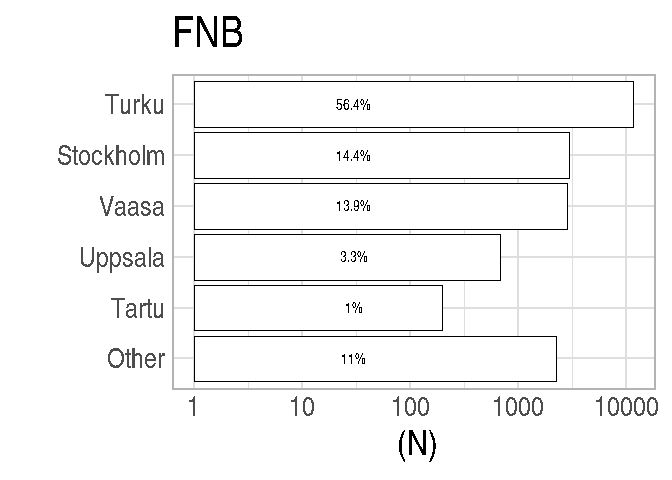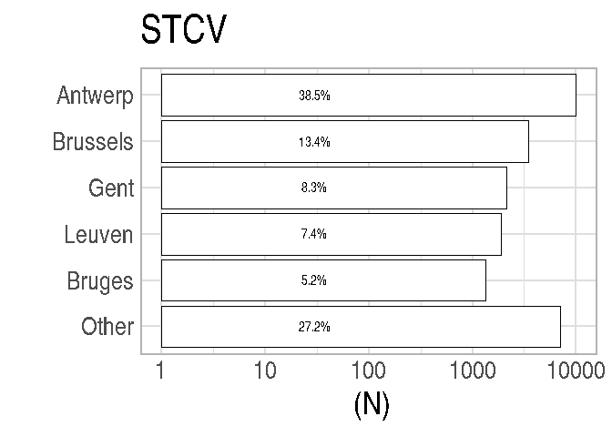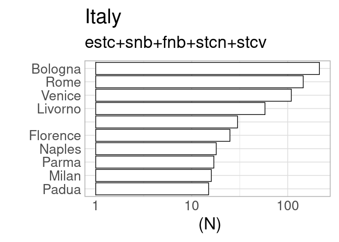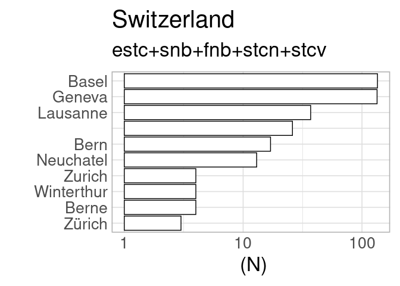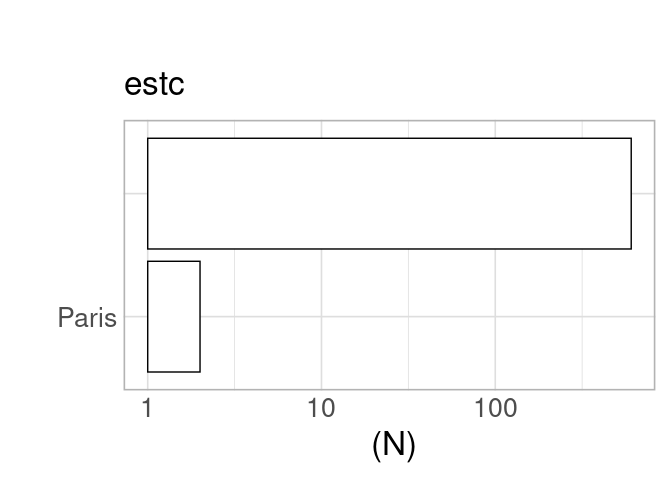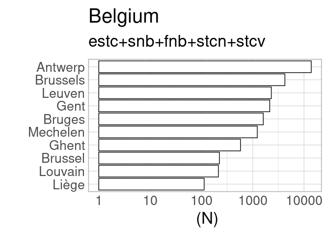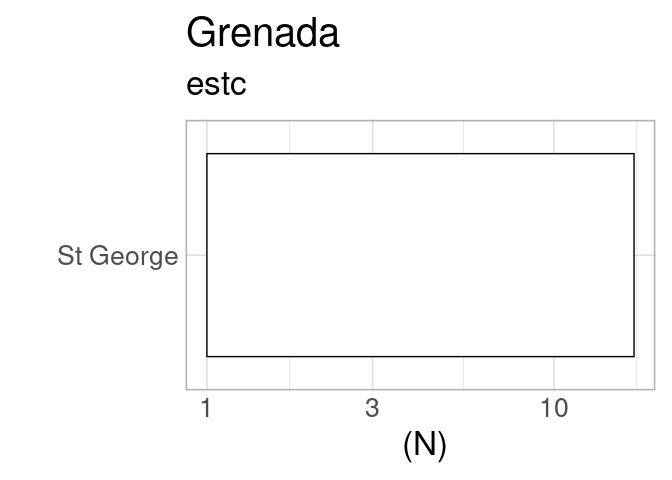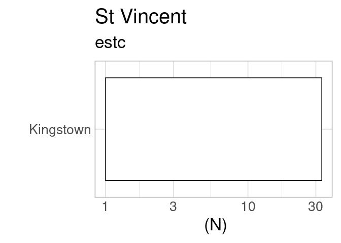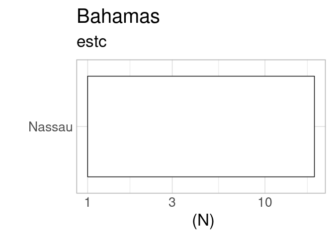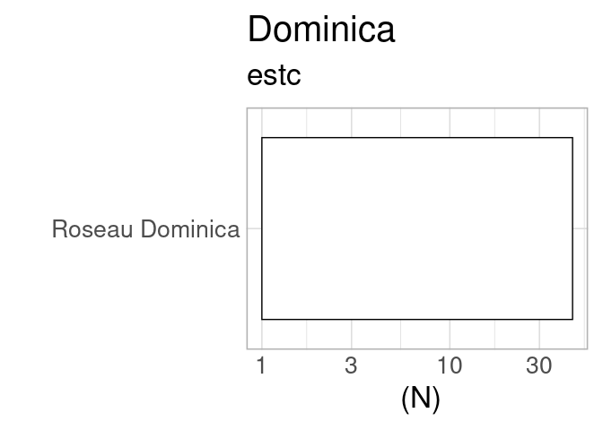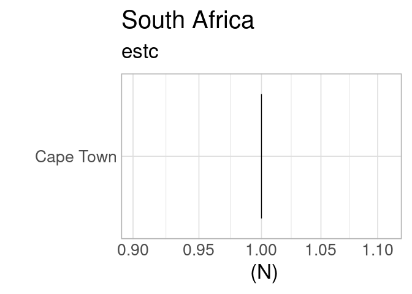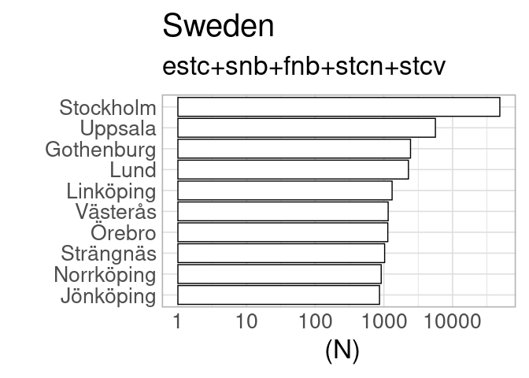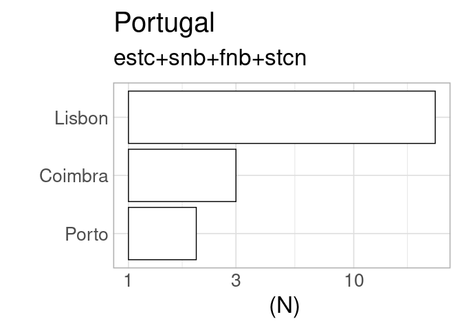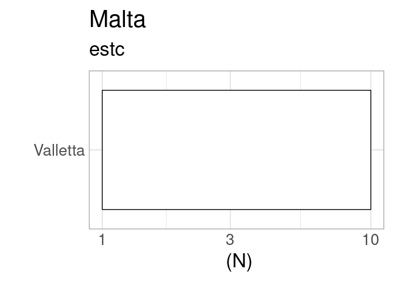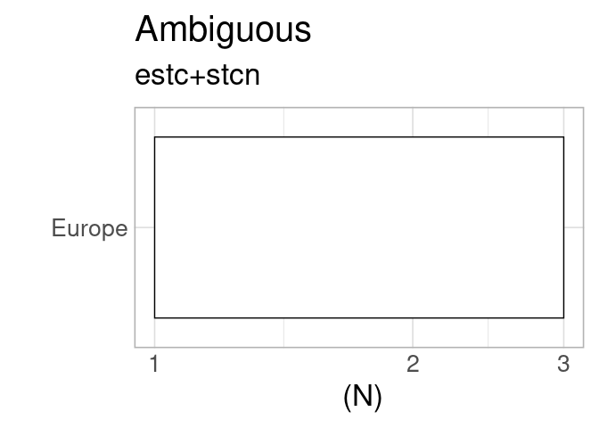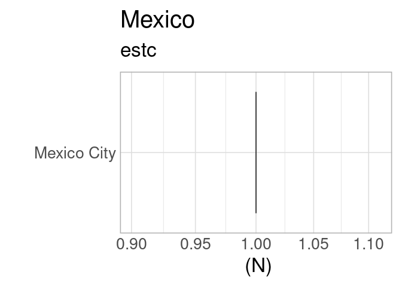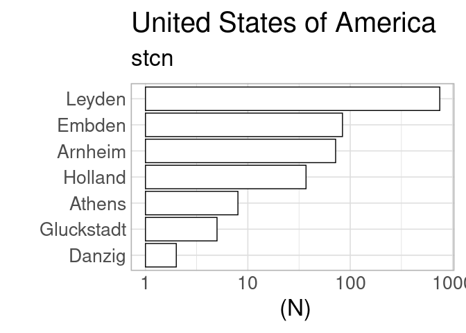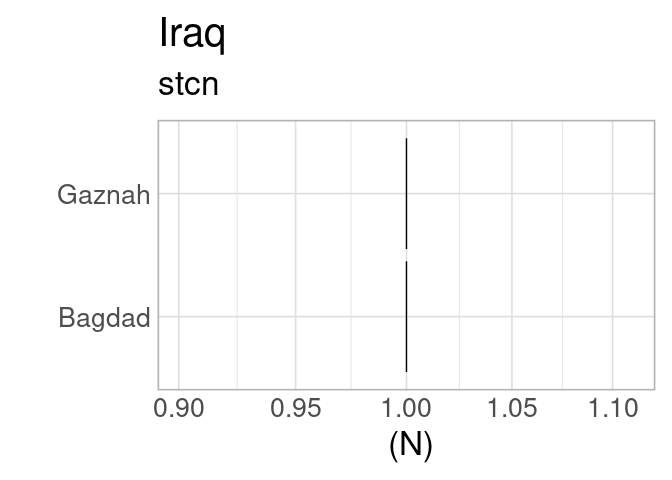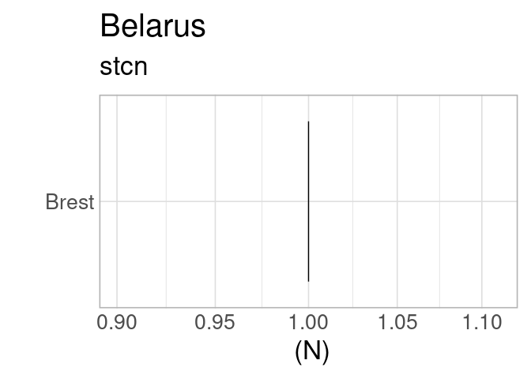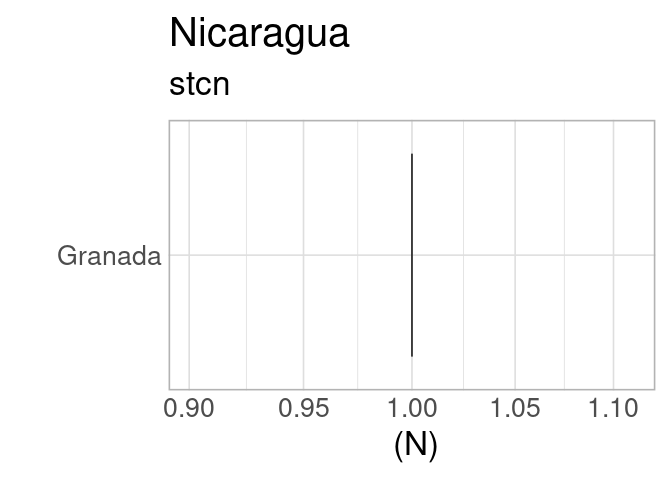

Countries per catalog
---------------------

Summary of selected countries per catalog, for quality control purposes.
Should have the same countries than above.

    ## [1] "estc"
    ## 
    ##                                   Ambiguous               Antiqua 
    ##                   608                     2                    21 
    ##                 Aruba             Australia               Austria 
    ##                     2                     3                    31 
    ##               Bahamas              Barbados               Belgium 
    ##                    19                    58                   562 
    ##                Canada                  Cuba        Czech Republic 
    ##                   976                     3                     2 
    ##        Czezh Republic               Denmark              Dominica 
    ##                     1                    34                    45 
    ##               England                France                Geneva 
    ##                346600                  3861                     1 
    ##               Germany               Grenada            Guadaloupe 
    ##                   825                    17                     4 
    ##             Guernesey              Guernsey                 Haiti 
    ##                    12                    11                    51 
    ##               Hamburg               Hungary                 India 
    ##                     1                     2                   310 
    ##               Ireland           Isle of Man                 Italy 
    ##                 26621                    17                   243 
    ##               Jamaica                Latvia                 Malta 
    ##                   249                     3                    10 
    ##            Martinique                Mexico           Netherlands 
    ##                    11                     1                  2138 
    ##      Northern Ireland                Poland              Portugal 
    ##                   872                     6                    11 
    ##                Russia Saint Kitts and Nevis           Saint Lucia 
    ##                    25                    20                     1 
    ##              Scotland          South Africa                 Spain 
    ##                 38980                     1                    15 
    ##             Sri Lanka          St Eustatius            St Vincent 
    ##                     2                     1                    33 
    ##                Sweden           Switzerland   Trinidad and Tobago 
    ##                    32                   290                     4 
    ##                Turkey                   USA                 Wales 
    ##                     1                 33615                     1 
    ## [1] "----------"
    ## [1] "snb"
    ## 
    ##        Austria        Belgium         Canada     Copenhagen Czech Republic 
    ##             16             13              1             32              5 
    ##        Denmark        England        Estonia        Finland         France 
    ##            423            481            167           1730            241 
    ##        Germany        Ireland          Italy         Latvia      Lithuania 
    ##           1356              5            108             84             11 
    ##    Netherlands         Norway         Poland       Portugal         Russia 
    ##            211             25             82              8             61 
    ##       Scotland          Spain         Sweden    Switzerland        Ukraine 
    ##              8             15          66238             35              1 
    ##            USA 
    ##             22 
    ## [1] "----------"
    ## [1] "fnb"
    ## 
    ##     Austria     Belgium  Copenhagen     Denmark     England     Estonia 
    ##           2           2           3          18          50         256 
    ##     Finland      France     Germany       Italy      Latvia   Lithuania 
    ##       14525          31         254           4          39           1 
    ## Netherlands      Poland    Portugal      Russia    Scotland       Spain 
    ##          70           6           1         106           1           1 
    ##      Sweden Switzerland         USA 
    ##        3818           1           1 
    ## [1] "----------"
    ## [1] "stcn"
    ## 
    ##                Ambiguous                Australia                  Austria 
    ##                        1                       63                      117 
    ##                  Belarus                  Belgium                   Canada 
    ##                        1                     5247                        1 
    ##           Czech Republic                  Denmark                  England 
    ##                        6                       12                     1200 
    ##                  Estonia                  Finland                   France 
    ##                        5                       31                     1845 
    ##                  Germany                    Haiti                  Hungary 
    ##                     4102                        1                        4 
    ##                    India                Indonesia                     Iraq 
    ##                        2                        3                        2 
    ##                  Ireland                    Italy                Lithuania 
    ##                        8                      350                        1 
    ##              Netherlands                Nicaragua                   Norway 
    ##                   129924                        1                       52 
    ##                   Poland                 Portugal                   Russia 
    ##                       20                        8                        6 
    ##    Saint Kitts and Nevis                 Scotland                 Slovakia 
    ##                        1                       67                        2 
    ##                    Spain                Sri Lanka                 Suriname 
    ##                       17                       43                     4862 
    ##                   Sweden              Switzerland                   Turkey 
    ##                       94                       57                        9 
    ##                  Ukraine           United Kingdom United States of America 
    ##                        1                        2                      958 
    ##                      USA 
    ##                      653 
    ## [1] "----------"
    ## [1] "stcv"
    ## 
    ##        Austria        Belgium Czech Republic        England         France 
    ##             10          20723              1             43            156 
    ##        Germany          Italy    Netherlands       Scotland         Sweden 
    ##             36              6            120              1              2 
    ##    Switzerland            USA 
    ##              3              1 
    ## [1] "----------"
