Publication place analysis
==========================

Top places
----------

Top towns according to title count in each “national” context.

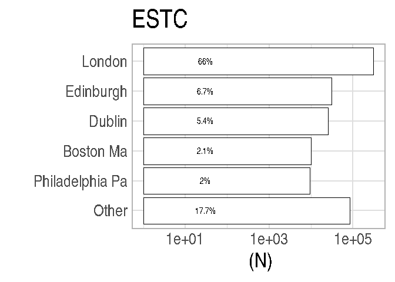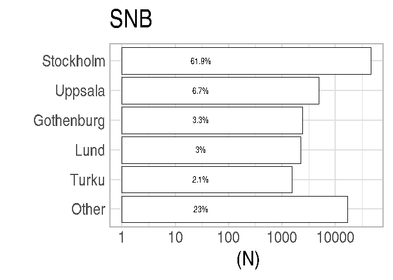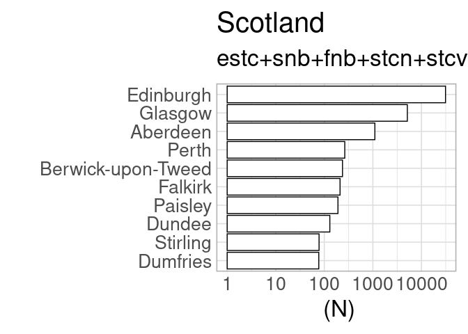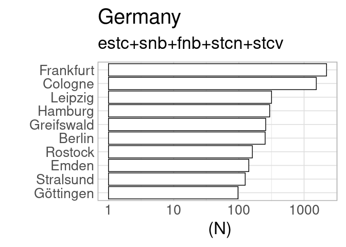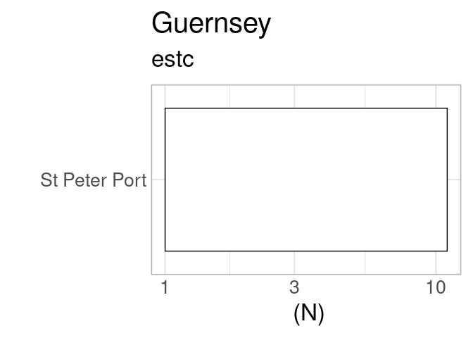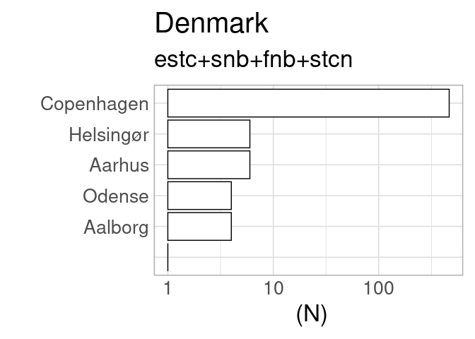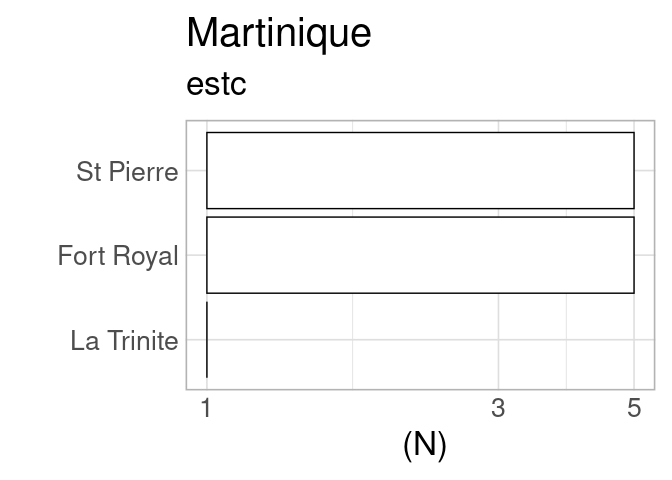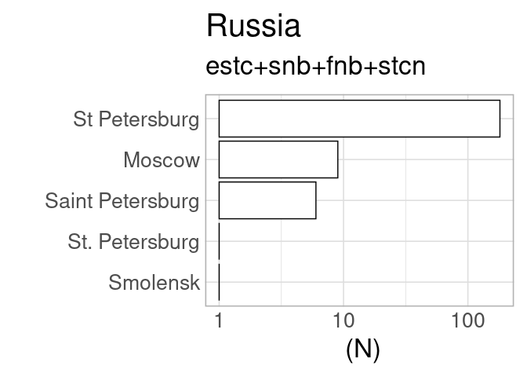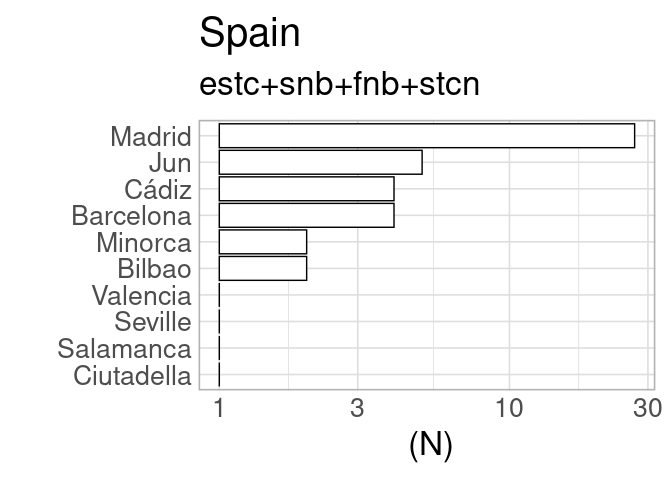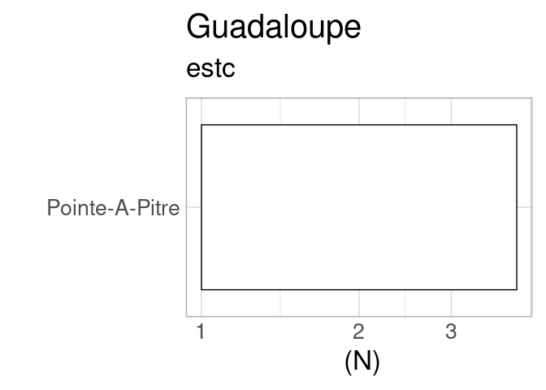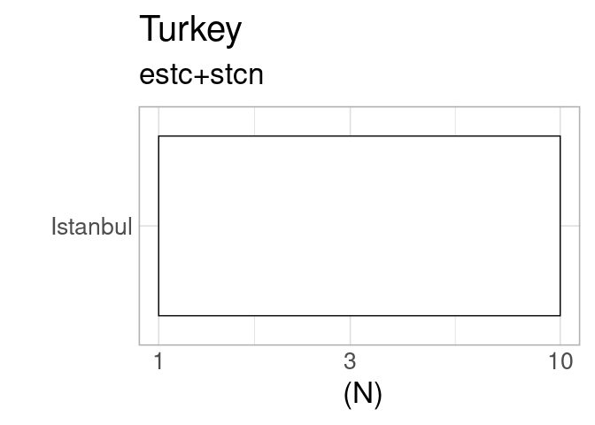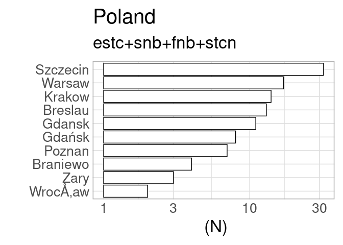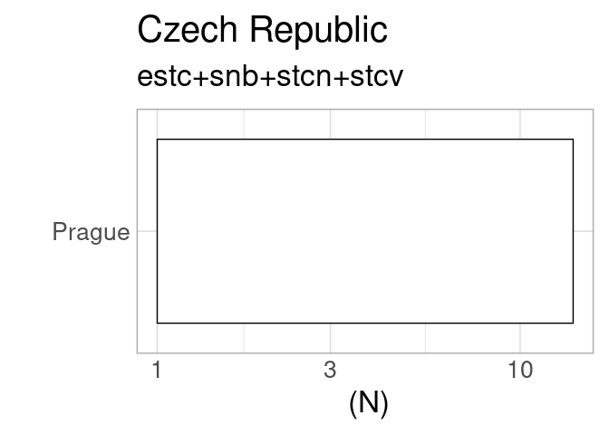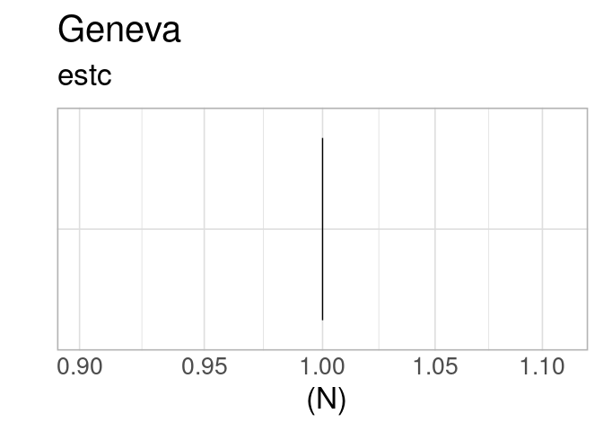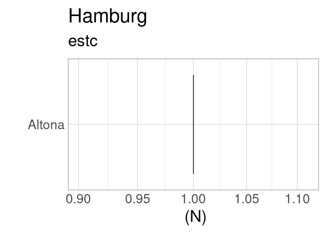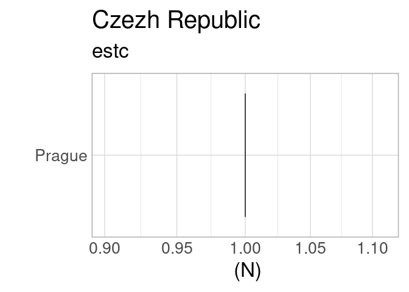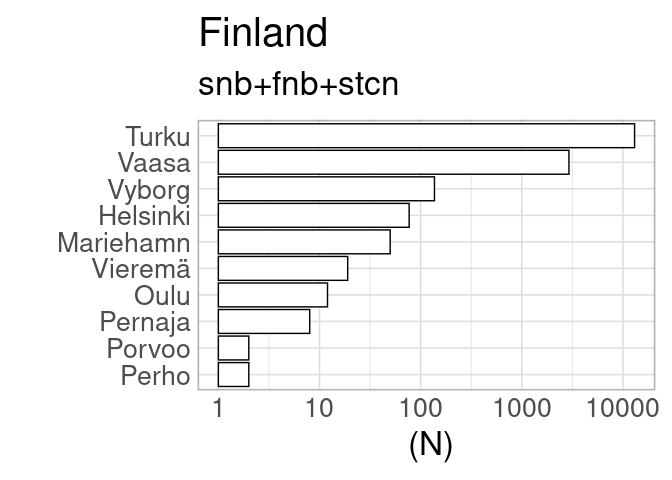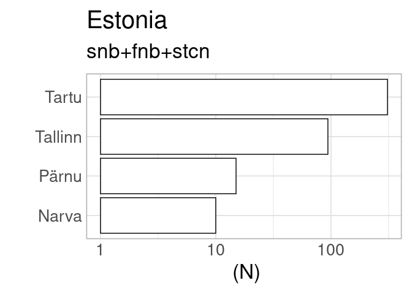

Countries per catalog
---------------------

Summary of selected countries per catalog, for quality control purposes.
Should have the same countries than above.

    ## [1] "estc"
    ## 
    ##                                   Ambiguous               Antiqua 
    ##                   613                     2                    22 
    ##                 Aruba             Australia               Austria 
    ##                     2                     3                    34 
    ##               Bahamas              Barbados               Belgium 
    ##                    24                    59                   567 
    ##                Canada                  Cuba        Czech Republic 
    ##                  1041                     4                     2 
    ##        Czezh Republic               Denmark              Dominica 
    ##                     1                    39                    45 
    ##               England                France                Geneva 
    ##                354755                  3902                     1 
    ##               Germany               Grenada            Guadaloupe 
    ##                   866                    18                     4 
    ##             Guernesey              Guernsey                 Haiti 
    ##                    13                    11                    51 
    ##               Hamburg               Hungary                 India 
    ##                     1                     2                   336 
    ##               Ireland           Isle of Man                 Italy 
    ##                 27523                    17                   253 
    ##               Jamaica                Latvia                 Malta 
    ##                   266                     3                    10 
    ##            Martinique                Mexico           Netherlands 
    ##                    11                     1                  2148 
    ##      Northern Ireland                Poland              Portugal 
    ##                   884                     6                    12 
    ##                Russia Saint Kitts and Nevis           Saint Lucia 
    ##                    27                    20                     1 
    ##              Scotland          South Africa                 Spain 
    ##                 40019                     4                    15 
    ##             Sri Lanka          St Eustatius            St Vincent 
    ##                     2                     1                    37 
    ##              Suriname                Sweden           Switzerland 
    ##                     2                    33                   303 
    ##   Trinidad and Tobago                Turkey                   USA 
    ##                     4                     1                 35452 
    ##                 Wales 
    ##                     1 
    ## [1] "----------"
    ## [1] "snb"
    ## Sweden 
    ## 310100 
    ## [1] "----------"
    ## [1] "fnb"
    ## Finland 
    ##   59639 
    ## [1] "----------"
    ## [1] "stcn"
    ## Netherlands 
    ##      134249 
    ## [1] "----------"
