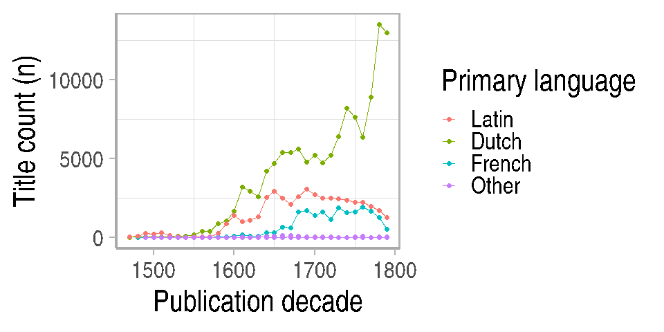

STCN analyses
=============

    # Onks jossain kuva koko STCN:stä / kielten osuudet vuosikymmenittäin
    # (tai vastaava)? Sellainen, josta näkyis kokonaisuudessaan ranskan
    # osuus?

    df <- catalogs$stcn %>%
            group_by(publication_decade, language_primary) %>%
        summarize(n=n())

    ## `summarise()` has grouped output by 'publication_decade'. You can override using the `.groups` argument.

    # Keep top lang and put rest in other category
    df$language_primary <- compress_field(df$language_primary, topn = 3, rest = "Other")
    p <- ggplot(df, aes(x=publication_decade, color=language_primary, y=n)) +
           #geom_bar(stat="identity") +
           geom_line() +
           geom_point() +              
           labs(x = "Publication decade", y = "Title count (n)", color="Primary language") +
           theme_comhis("continuous")

    print(p)

