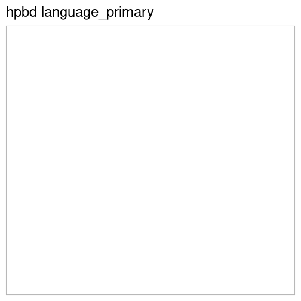

# Language analysis

 * Catalog: hpbd
 * Field: language_primary 
 * Country: Netherlands, Austria, Estonia  
 * Entries: 0
 * Unique entries for this field: 0  

## Top languages by country

## Top languages by town

London (ESTC)
Oxford (ESTC)
Cambridge (ESTC)

Leiden (HPB)
Amsterdam (HPB)
Wien (HPB)
Salzburg (HPB)
Tallinn (HPB)
Tartu (HPB)

Turku (FNB)

Stockholm (SNB)
Lund (SNB)
Uppsala (SNB)

